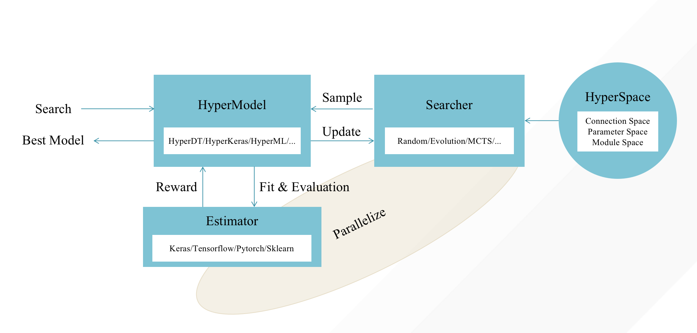
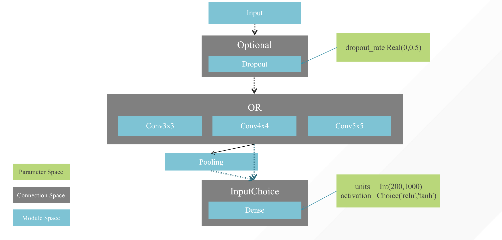

# HyperNets


## HyperNets: An Open Source Automated Machine Learning Framework
HyperNets is a general AutoML framework that can meet various needs such as feature engineering, hyperparameter optimization, and neural architecture search, thereby helping users achieve the end-to-end automated machine learning pipeline.
 


## Overview
### Conceptual Model
<p align="center">

</p>

### Illustration of the Search Space 
<p align="center">

</p>

## Exapmple
```python
from hypernets.searchers.mcts_searcher import *
from hypernets.frameworks.keras.layers import *
from hypernets.frameworks.keras.models import HyperKeras
from hypernets.core.callbacks import SummaryCallback

def get_space():
    space = HyperSpace()
    with space.as_default():
        in1 = Input(shape=(10,))
        dense1 = Dense(10, activation=Choice(['relu', 'tanh', None]), use_bias=Bool())(in1)
        bn1 = BatchNormalization()(dense1)
        dropout1 = Dropout(Choice([0.3, 0.4, 0.5]))(bn1)
        Dense(2, activation='softmax', use_bias=True)(dropout1)
    return space

mcts = MCTSSearcher(get_space, max_node_space=4)
hk = HyperKeras(mcts, optimizer='adam', loss='sparse_categorical_crossentropy', metrics=['accuracy'],
                callbacks=[SummaryCallback()])

x = np.random.randint(0, 10000, size=(100, 10))
y = np.random.randint(0, 2, size=(100), dtype='int')

hk.search(x, y, x, y, max_trails=10)
assert hk.best_model

```


## DataCanvas
HyperNets is an open source project created by [DataCanvas](https://www.datacanvas.com/). 