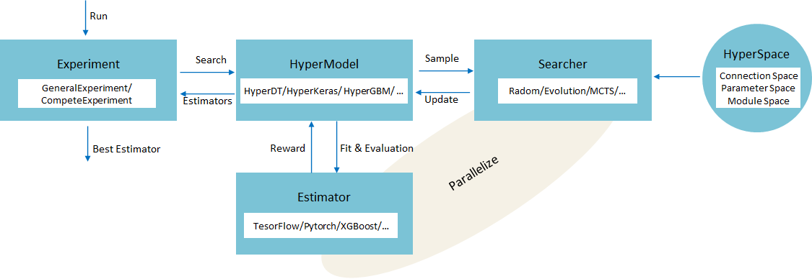
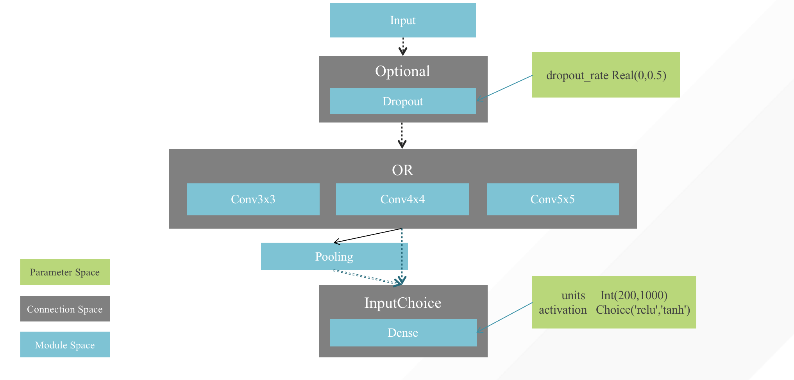
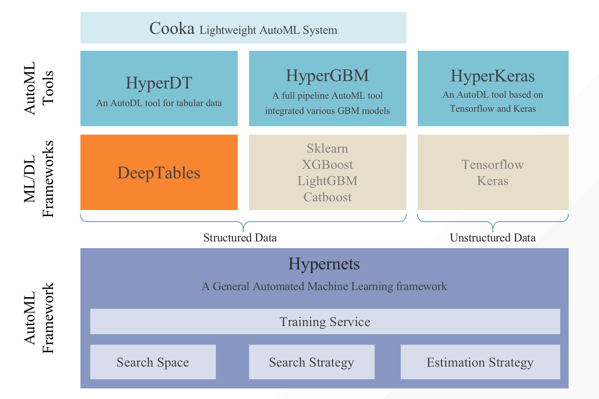

# Hypernets

[](https://pypi.org/project/hypernets)
[](https://pypi.org/project/hypernets)
[](https://pepy.tech/project/hypernets)
[](https://pypi.org/project/hypernets)

## Hypernets: A General Automated Machine Learning Framework
Hypernets is a general AutoML framework, based on which it can implement automatic optimization tools for various machine learning frameworks and libraries, including deep learning frameworks such as tensorflow, keras, pytorch, and machine learning libraries like sklearn, lightgbm, xgboost, etc.
We introduced an abstract search space representation, taking into account the requirements of hyperparameter optimization and neural architecture search(NAS), making Hypernets a general framework that can adapt to various automated machine learning needs.


## Overview
### Conceptual Model
<p align="center">

</p>

### Illustration of the Search Space 
<p align="center">

</p>


## Installation
```shell script
pip install hypernets
```

***Verify installation***:
```shell script
python -c "from examples import smoke_testing;"
```

## Hypernets related projects

* [HyperGBM](https://github.com/DataCanvasIO/HyperGBM): A full pipeline AutoML tool integrated various GBM models.
* [HyperDT/DeepTables](https://github.com/DataCanvasIO/DeepTables): An AutoDL tool for tabular data.
* [HyperKeras](https://github.com/DataCanvasIO/HyperKeras): An AutoDL tool for Neural Architecture Search and Hyperparameter Optimization on Tensorflow and Keras.
* [Cooka](https://github.com/DataCanvasIO/Cooka): Lightweight interactive AutoML system.
* [Hypernets](https://github.com/DataCanvasIO/Hypernets): A general automated machine learning framework.



## Neural Architecture Search
* [Define A DNN Search Space](https://hypernets.readthedocs.io/en/latest/nas.html#define-a-dnn-search-space)
* [Define A CNN Search Space](https://hypernets.readthedocs.io/en/latest/nas.html#define-a-cnn-search-space)
* [Define An ENAS Micro Search Space](https://hypernets.readthedocs.io/en/latest/nas.html#define-an-enas-micro-search-space)


## DataCanvas
Hypernets is an open source project created by [DataCanvas](https://www.datacanvas.com/). 