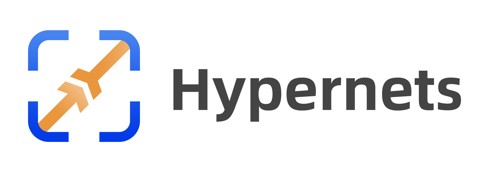

<p align="center">



[](https://pypi.org/project/hypernets)
[](https://pepy.tech/project/hypernets)
[](https://pypi.org/project/hypernets)

## We Are Hiring！
Dear folks, we are offering challenging opportunities located in Beijing for both professionals and students who are keen on AutoML/NAS. Come be a part of DataCanvas! Please send your CV to yangjian@zetyun.com. (Application deadline: TBD.)  

## Hypernets: A General Automated Machine Learning Framework
Hypernets is a general AutoML framework, based on which it can implement automatic optimization tools for various machine learning frameworks and libraries, including deep learning frameworks such as tensorflow, keras, pytorch, and machine learning libraries like sklearn, lightgbm, xgboost, etc.
We introduced an abstract search space representation, taking into account the requirements of hyperparameter optimization and neural architecture search(NAS), making Hypernets a general framework that can adapt to various automated machine learning needs. As an abstraction computing layer, tabular toolbox, has successfully implemented in various tabular data types: pandas, dask, cudf, etc.  


## Overview
### Conceptual Model
<p align="center">

</p>

### Illustration of the Search Space 
<p align="center">

</p>


## Installation

### Conda

Install Hypernets with `conda` from the channel *conda-forge*:

```bash
conda install -c conda-forge hypernets
```

### Pip
Install Hypernets with different options:

* Typical installation:
```bash
pip install hypernets
```

* To run Hypernets in JupyterLab/Jupyter notebook, install with command:
```bash
pip install hypernets[notebook]
```

* To run Hypernets in distributed Dask cluster, install with command:
```bash
pip install hypernets[dask]
```

* To support dataset with simplified Chinese in feature generation, 
  * Install `jieba` package before running Hypernets.
  * OR install Hypernets with command:
```bash
pip install hypernets[zhcn]
```

* Install all above with one command:
```bash
pip install hypernets[all]
```


***Verify installation***:
```bash
python -m hypernets.examples.smoke_testing
```

## Related Links

* [A Brief Tutorial for Developing AutoML Tools with Hypernets](https://github.com/BochenLv/knn_toy_model/blob/main/Introduction.md)

## Hypernets related projects
* [Hypernets](https://github.com/DataCanvasIO/Hypernets): A general automated machine learning (AutoML) framework.
* [HyperGBM](https://github.com/DataCanvasIO/HyperGBM): A full pipeline AutoML tool integrated various GBM models.
* [HyperDT/DeepTables](https://github.com/DataCanvasIO/DeepTables): An AutoDL tool for tabular data.
* [HyperTS](https://github.com/DataCanvasIO/HyperTS): A full pipeline AutoML&AutoDL tool for time series datasets.
* [HyperKeras](https://github.com/DataCanvasIO/HyperKeras): An AutoDL tool for Neural Architecture Search and Hyperparameter Optimization on Tensorflow and Keras.
* [HyperBoard](https://github.com/DataCanvasIO/HyperBoard): A visualization tool for Hypernets.
* [Cooka](https://github.com/DataCanvasIO/Cooka): Lightweight interactive AutoML system.


## Documents
* [Overview](https://hypernets.readthedocs.io/en/latest/overview.html)
* [QuickStart](https://hypernets.readthedocs.io/en/latest/quick_start.html)
* [Search Space](https://hypernets.readthedocs.io/en/latest/search_space.html)
* [Searcher](https://hypernets.readthedocs.io/en/latest/searchers.html)
* [HyperModel](https://hypernets.readthedocs.io/en/latest/hypermodels.html)
* [Experiment](https://hypernets.readthedocs.io/en/latest/experiment.html)
## Neural Architecture Search
* [Define A DNN Search Space](https://hypernets.readthedocs.io/en/latest/nas.html#define-a-dnn-search-space)
* [Define A CNN Search Space](https://hypernets.readthedocs.io/en/latest/nas.html#define-a-cnn-search-space)
* [Define An ENAS Micro Search Space](https://hypernets.readthedocs.io/en/latest/nas.html#define-an-enas-micro-search-space)


## DataCanvas
Hypernets is an open source project created by [DataCanvas](https://www.datacanvas.com/). 
