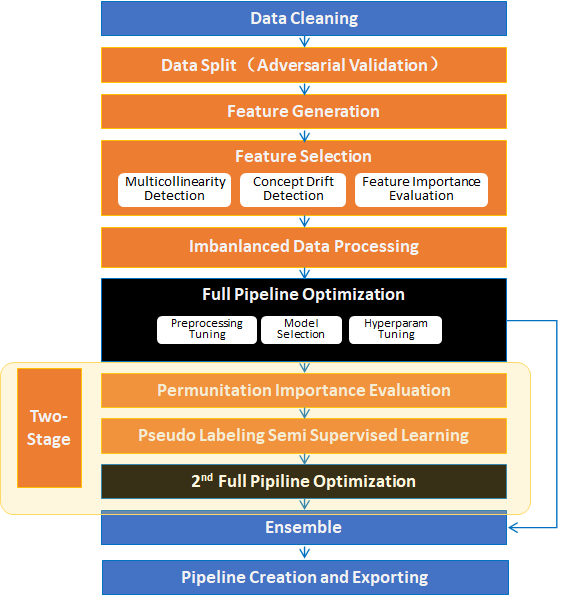
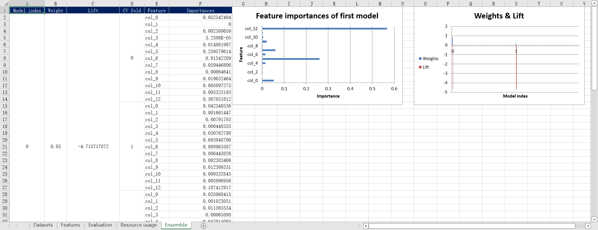

Experiment
================

Experiment is the playground to prepare training and testing data, and search the optimized estimator with HyperModel. Use `experiment` with the following steps:

* Prepare datasets

  * training data(X_train, y_train): required
  * evaluation data(X_eval, y_eval): optional, will be split from training data if not provided
  * testing data(X_test only): optional, the sample of the prediction data, is used to optimize the experiment

* Create HyperModel instance with your selected implementation

  * The `PlainModel` is provided as a plain implementation in this project.
  * More implementations can be found from `DeepTables <https://github.com/DataCanvasIO/DeepTables>`_, `HyperGBM <https://github.com/DataCanvasIO/HyperGBM>`_, `HyperKeras <https://github.com/DataCanvasIO/HyperKeras>`_, etc.

* Create experiment instance with the prepared datasets and HyperModel instance and other arguments required by your selected experiment implementation ( *GeneralExperiment* , *CompeteExperiment* , or your customized implementation).
* Call experiment's *.run()* to search the optimized estimator.

GeneralExperiment
-------------------------

GeneralExperiment is the basic implementation of experiment. Example code:

.. code-block:: python

    from sklearn.model_selection import train_test_split

    from hypernets.experiment import GeneralExperiment
    from hypernets.searchers import make_searcher
    from hypernets.tabular.datasets import dsutils

    def create_hyper_model(reward_metric='auc', optimize_direction='max'):
        from hypernets.examples.plain_model import PlainModel, PlainSearchSpace

        search_space = PlainSearchSpace()
        searcher = make_searcher('random', search_space_fn=search_space, optimize_direction=optimize_direction)
        hyper_model = PlainModel(searcher=searcher, reward_metric=reward_metric, callbacks=[])

        return hyper_model

    def general_experiment_with_heart_disease():
        hyper_model = create_hyper_model()

        X = dsutils.load_heart_disease_uci()
        y = X.pop('target')

        X_train, X_test, y_train, y_test = train_test_split(X, y, test_size=0.3)

        experiment = GeneralExperiment(hyper_model, X_train, y_train, eval_size=0.3)
        estimator = experiment.run(max_trials=5)

        score = estimator.evaluate(X_test, y_test, metrics=['auc', 'accuracy', 'f1', 'recall', 'precision'])
        print('evaluate score:', score)

    if __name__ == '__main__':
        general_experiment_with_heart_disease()

CompeteExperiment
--------------------------------

CompeteExperiment is an implementation of experiment with many advanced features for tabular data, such as data cleaning, feature generation, feature selection, semi-supervised machine learning, two-stages searching etc.

Quick start
>>>>>>>>>>>>>>>>>>>>

Basically, use *CompeteExperiment* with default settings just like *GeneralExperiment*.

.. code-block:: python

    from sklearn.model_selection import train_test_split
    from sklearn.preprocessing import LabelEncoder

    from hypernets.experiment import CompeteExperiment
    from hypernets.tabular.datasets import dsutils
    from hypernets.tabular.metrics import calc_score

    def create_hyper_model(reward_metric='auc', optimize_direction='max'):
        from hypernets.core.callbacks import SummaryCallback
        from hypernets.examples.plain_model import PlainModel, PlainSearchSpace
        from hypernets.searchers import make_searcher
        from hypernets.tabular.sklearn_ex import MultiLabelEncoder

        search_space = PlainSearchSpace(enable_dt=True, enable_lr=True, enable_nn=False)
        searcher = make_searcher('random', search_space_fn=search_space, optimize_direction=optimize_direction)
        hyper_model = PlainModel(searcher=searcher, reward_metric=reward_metric, callbacks=[SummaryCallback()],
                                 transformer=MultiLabelEncoder)

        return hyper_model

    def experiment_with_bank_data(row_count=3000):
        X = dsutils.load_bank()
        if row_count is not None:
            X = X.head(row_count)
        X['y'] = LabelEncoder().fit_transform(X['y'])
        y = X.pop('y')

        X_train, X_test, y_train, y_test = train_test_split(X, y, test_size=0.3, random_state=9527)

        experiment = CompeteExperiment(create_hyper_model(), X_train, y_train, max_trials=10)
        estimator = experiment.run()

        preds = estimator.predict(X_test)
        proba = estimator.predict_proba(X_test)

        score = calc_score(y_test, preds, proba, metrics=['auc', 'accuracy', 'f1', 'recall', 'precision'])
        print('evaluate score:', score)
        assert score

    if __name__ == '__main__':
        experiment_with_bank_data()

Set the Number of Search Trials
>>>>>>>>>>>>>>>>>>>>>>>>>>>>>>>>>>>>>>>>>>>>>>>>>>

One can set the max search trial number by adjusting `max_trials`.

The following codes set the max trial times as 300:

.. code-block:: python

    hyper_model = create_hyperModel()
    experiment = CompeteExperiment(hyper_model, max_trials=300, ...)

Use Cross Validation
>>>>>>>>>>>>>>>>>>>>>>>>>>

Users can apply cross validation in the experiment by manually setting parameter `cv`. Setting `cv` as 'False' will lead the experiment to avoid using cross validation and apply train_test_split instead. On the other hand, when `cv` is `True`, the experiment will use cross validation where the number of folds can be adjusted through the parameter `num_folds`. The default value of `num_folds` is 3.

Example code when `cv=True`:

.. code-block:: python

    hyper_model = create_hyperModel()
    experiment = CompeteExperiment(hyper_model, cv=True, num_folds=5, ...)

Evaluation dataset
>>>>>>>>>>>>>>>>>>>>>>>>>>>

When `cv=False`, training model will require evaluating its performance additionally on evaluation dataset. This can be done by setting `X_eval` and `y_eval` when creating `CompeteExperiment`. For example:

.. code-block:: python

    df = dsutils.load_blood()
    X = df.copy()
    y = X.pop(target)
    X_train, X_eval, y_train, y_eval = train_test_split(X, y , test_size=0.3)
    hyper_model = create_hyperModel()
    experiment = CompeteExperiment(hyper_model, X_train=X_train,y_train=y_train, X_eval=X_eval, y_eval=y_eval, ...)

If the `X_eval` or `y_eval` is None, the experiment object will split the `X_train` and `y_train` to get an evaluation dataset, whose size can be adjusted by setting `eval_size`:

.. code-block:: python

    df = dsutils.load_blood()
    X = df.copy()
    y = X.pop(target)
    hyper_model = create_hyperModel()
    experiment = CompeteExperiment(hyper_model, X_train=X, y_train=y, eval_size=0.3, ...)

Set the Evaluation Criterion
>>>>>>>>>>>>>>>>>>>>>>>>>>>>>>>>>

The default evaluation criterion is `accuracy` for classification task is, and `rmse` for regression task. Other criterions can be set by `reward_metric`. For example:

.. code-block:: python

    hyper_model = create_hyperModel()
    experiment = CompeteExperiment(hyper_model, reward_metric='auc', ...)

Set the Early Stopping
>>>>>>>>>>>>>>>>>>>>>>>>>>>>>>>>>>>>>>>>>>>>>>>>>>

One can set the early stopping strategy with settings of `early_stopping_round`, `early_stopping_time_limit` and `early_stopping_reward`.

The following code sets the max searching time as 3 hours:

.. code-block:: python

    hyper_model = create_hyperModel()
    experiment = CompeteExperiment(hyper_model, max_trials=300, early_stopping_time_limit=3600 * 3, ...)

Choose a Searcher
>>>>>>>>>>>>>>>>>>>>>>>

One can choose a specific searcher for the experiment by setting the parameter `searcher`.

.. code-block:: python

    hyper_model = create_hyperModel()
    experiment = CompeteExperiment(hyper_model, searcher='random', ...)

Furthermore, you can customize a new searcher object for experiment, for an example:

.. code-block:: python

    from hypernets.searchers import MCTSSearcher

    my_searcher = MCTSSearcher(lambda: search_space_general(n_estimators=100),
                               max_node_space=20,
                               optimize_direction='max')
    hyper_model = create_hyperModel()
    experiment = CompeteExperiment(hyper_model, searcher=my_searcher, ...)

Ensemble Models
>>>>>>>>>>>>>>>>>>>>>

`CompeteExperiment` automatically turns on the model ensemble function to get a better model when created. It will ensemble the best 20 models while the number for ensembling can be changed by setting `ensemble_size` as the following code, where `ensemble_size=0` means to disable ensembling.

.. code-block:: python

    hyper_model = create_hyperModel()
    experiment = CompeteExperiment(hyper_model, ensemble_size=10, ...)

Data cleaning
>>>>>>>>>>>>>>>>>

The first step of the *CompeteExperiment* is to perform data cleaning with DataCleaner in Hypernets. Note that this step can not be disabled but can be adjusted with DataCleaner in the following ways：

* nan_chars： value or list, (default None), replace some characters with np.nan
* correct_object_dtype： bool, (default True), whether correct the data types
* drop_constant_columns： bool, (default True), whether drop constant columns
* drop_duplicated_columns： bool, (default False), whether delete repeated columns
* drop_idness_columns： bool, (default True), whether drop id columns
* drop_label_nan_rows： bool, (default True), whether drop rows with target values np.nan
* replace_inf_values： (default np.nan), which values to replace np.nan with
* drop_columns： list, (default None), drop which columns
* reserve_columns： list, (default None), reserve which columns when performing data cleaning
* reduce_mem_usage： bool, (default False), whether try to reduce the memory usage
* int_convert_to： bool, (default 'float'), transform int to other types，None for no transformation

If nan is represented by '\\N' in data，users can replace '\\N' back to np.nan when performing data cleaning as follows:

.. code-block:: python

    hyper_model = create_hyperModel()
    experiment = CompeteExperiment(hyper_model, data_cleaner_args={'nan_chars': r'\N'}, ...)
    ...

Feature generation
>>>>>>>>>>>>>>>>>>>>>>

*CompeteExperiment* is capable of performing feature generation, which can be turned on by setting *feature_generation=True* when creating experiment with *make_experiment*. There are several options:

* feature_generation_continuous_cols：list (default None)), continuous feature, inferring automatically if set as None.
* feature_generation_categories_cols：list (default None)), categorical feature, need to be set explicitly, *CompeteExperiment* can not perform automatic inference for this one.
* feature_generation_datetime_cols：list (default None), datetime feature, inferring automatically if set as None.
* feature_generation_latlong_cols：list (default None), latitude and longtitude feature, inferring automatically if set as None.
* feature_generation_text_cols：list (default None), text feature, inferring automatically if set as None.
* feature_generation_trans_primitives：list (default None), transformations for feature generation, inferring automatically if set as None.

When feature_generation_trans_primitives=None, *CompeteExperiment* will automatically infer the types used for transforming based on the default features. Specifically, different transformations will be adopted for different types:

* continuous_cols： None, need to be set explicitly.
* categories_cols： cross_categorical.
* datetime_cols： month, week, day, hour, minute, second, weekday, is_weekend.
* latlong_cols： haversine, geohash
* text_cols：tfidf

An example code for enabling feature generation:

.. code-block:: python

    hyper_model = create_hyperModel()
    experiment = CompeteExperiment(hyper_model, feature_generation=True, ...)

Please see `featuretools <https://docs.featuretools.com/>`_ for more information.

Collinearity detection
>>>>>>>>>>>>>>>>>>>>>>>>>

There will often be some highly relevant features which are not informative but are more seen as noises. They are not very useful. On the contrary, the dataset will be affected by drifts of these features more heavily.

It is possible to handle these collinear features with *CompeteExperiment*. This can be simply enabled by setting *collinearity_detection=True* when creating experiment.

Example code for using collinearity detection

.. code-block:: python

    hyper_model = create_hyperModel()
    experiment = CompeteExperiment(hyper_model, collinearity_detection=True, ...)
    ...

Drift detection
>>>>>>>>>>>>>>>>>>>>>

Concept drift is one of the major challenge for machine learning. The model will often perform worse in practice due to the fact that the data distributions will change along with time. To handle this problem, *CompeteExperiment* adopts Adversarial Validation to detect whether there is any drifted features and drop them to maintain a good performance.

To enable drift detection, one needs to set *drift_detection=True* when creating experiment and provide *X_test*.

Relevant parameters:

* drift_detection_remove_shift_variable : bool, (default=True), whether to detect the stability of every column first.
* drift_detection_variable_shift_threshold : float, (default=0.7), stability socres higher than this value will be dropped.
* drift_detection_threshold : float, (default=0.7), detecting scores higher than this value will be dropped.
* drift_detection_remove_size : float, (default=0.1), ratio of columns to be dropped.
* drift_detection_min_features : int, (default=10), the minimal number of columns to be reserved.
* drift_detection_num_folds : int, (default=5), the number of folds for cross validation.

An code example:

.. code-block:: python

    from io import StringIO
    import pandas as pd
    from hypergbm import make_experiment
    from hypernets.tabular.datasets import dsutils

    test_data = """
    Recency,Frequency,Monetary,Time
    2,10,2500,64
    4,5,1250,23
    4,9,2250,46
    4,5,1250,23
    4,8,2000,40
    2,12,3000,82
    11,24,6000,64
    2,7,1750,46
    4,11,2750,61
    1,7,1750,57
    2,11,2750,79
    2,3,750,16
    4,5,1250,26
    2,6,1500,41
    """

    df = dsutils.load_blood()
    X = df.copy()
    y = X.pop(target)
    test_df = pd.read_csv(StringIO(test_data))
    hyper_model = create_hyperModel()
    experiment = CompeteExperiment(hyper_model, X_train=X, y_train=y, X_test=test_df,
                                 drift_detection=True, ...)

    ...

Feature selection
>>>>>>>>>>>>>>>>>>>>>

*CompeteExperiment* evaluates the feature importance by training a pre-defined model. Then it chooses the most important ones among them to continue the model training.

To enable feature selection, one needs to set *feature_selection=True* when creating experiment. Relevant parameters:

* feature_selection_strategy：str, selection strategies(default threshold), can be chose from *threshold*, *number* and *quantile*.
* feature_selection_threshold：float, (default 0.1), selection threshold when the strategy is *threshold*, features with scores higher than this threshold will be selected.
* feature_selection_quantile：float, (default 0.2), selection threshold when the strategy is *quantile*, features with scores higher than this threshold will be selected.
* feature_selection_number：int or float, (default 0.8), selection numbers when the strategy is *number*.

An example code:

.. code-block:: python

    hyper_model = create_hyperModel()
    experiment = CompeteExperiment(hyper_model,
                                 feature_selection=True,
                                 feature_selection_strategy='quantile',
                                 feature_selection_quantile=0.3,
                                 ...)

UnderSampling pre-search
>>>>>>>>>>>>>>>>>>>>>>>>>>>

Normally, hyperparameter optimization utilizes all training data. However, this will cost a huge amount of time for a large dataset. To alleviate this problem, one can perform a pre-search with only a part of data to try more model parameters in the same amount of time. Better parameters will then be used for training with the whole data to obtain the optimal parameters.

To enable feature selection, one needs to set *down_sample_search=True*  when creating experiment. Relevant parameters:

* down_sample_search_size：int, float(0.0~1.0) or dict (default 0.1), number of examples used for pre-search.
* down_sample_search_time_limit：int, (default early_stopping_time_limit*0.33), time limit for pre-search.
* down_sample_search_max_trials：int, (default max_trials*3), max trail numbers for pre-search.

An example code:

.. code-block:: python

    hyper_model = create_hyperModel()
    experiment = CompeteExperiment(hyper_model,
                                 down_sample_search=True,
                                 down_sample_search_size=0.2,
                                 ...)

The second stage feature selection
>>>>>>>>>>>>>>>>>>>>>>>>>>>>>>>>>>>>>>

*CompeteExperiment* supports continuing data processing with the trained model, which is officially called  *Two-stage search*. There are two types of Two-stage processing supported by *CompeteExperiment*: Two-stage feature selection and pseudo label which will be covered in the rest of this section.

In *CompeteExperiment*, the second stage feature selection is to choose models with good performances in the first stage, and use *permutation_importance* to evaluate them to give better features.

To enable the second stage feature selection, one needs to set *feature_reselection=True*  when creating experiment. Relevant parameters:

* feature_reselection_estimator_size：int, (default=10), the number of models to be used for evaluating the importances of feature (top n best models in the first stage).
* feature_reselection_strategy：str, selection strategy(default threshold), available selection strategies include *threshold*, *number*, *quantile*.
* feature_reselection_threshold：float, (default 1e-5), threshold when the selection strategy is *threshold*, importance scores higher than this values will be choosed.
* feature_reselection_quantile：float, (default 0.2),  threshold when the selection strategy is *quantile*, importance scores higher than this values will be choosed.
* feature_reselection_number：int or float, (default 0.8), the number of features to be selected when the strategy is *number*.

An example code:

.. code-block:: python

    hyper_model = create_hyperModel()
    experiment = CompeteExperiment(hyper_model,
                                 feature_reselection=True,
                                 ...)

Please refer to `scikit-learn <https://scikit-learn.org/stable/modules/permutation_importance.html>`_ for more information about  *permutation_importance*.

Pseudo label
>>>>>>>>>>>>>>>>>>

Pseudo label is a kind of semi-supervised machine learning method. It will assign labels predicted by the model trained in the first stage to some examples in test data. Then examples with higher confidence values than a threshold will be added into the trainig set to train the model again.

To enable feature selection, one needs to set *pseudo_labeling=True* when creating experiment. Relevant parameters:

* pseudo_labeling_strategy：str, selection strategy(default threshold), available strategies include *threshold*, *number* and  *quantile*.
* pseudo_labeling_proba_threshold：float(default 0.8),  threshold when the selection strategy is *threshold*, confidence scores higher than this values will be chose.
* pseudo_labeling_proba_quantile：float(default 0.8),  threshold when the selection strategy is *quantile*, importance scores higher than this values will be chose.
* pseudo_labeling_sample_number：float(0.0~1.0) or int (default 0.2), the number of top features to be selected when the strategy is *number*.
* pseudo_labeling_resplit：bool(default=False), whether split training and validation set after adding pseudo label examples. If set as False, all examples with pseudo labels will be added into training set to train the model. Otherwise, experiment will perform training set and validation set splitting for the new dataset with pseudo labels.

An example code:

.. code-block:: python

    from hypergbm import make_experiment

    X_test=...
    hyper_model = create_hyperModel()
    experiment = CompeteExperiment(hyper_model,
                                 X_test=X_test,
                                 pseudo_labeling=True,
                                 ...)

Note: Pseudo label is only valid for classification task.

Change the log level
>>>>>>>>>>>>>>>>>>>>>>>>>

The progress messages during training can be printed by setting `log_level` (`str` or `int`) to change the log level. Please refer to the `logging` package for more details. Besides, more thorough messages will show  when `verbose` is set as `1`.

The following codes sets the log level to 'INFO':

.. code-block:: python

    hyper_model = create_hyperModel()
    experiment = CompeteExperiment(hyper_model, log_level='INFO', verbose=1, ...)

Export experiment report
>>>>>>>>>>>>>>>>>>>>>>>>>>>

If you want to export the experiment report in Excel format after training, you can set `report_render` to `excel`.
The sample code for opening the experiment report is as follows:

.. code-block:: python

    from sklearn.model_selection import train_test_split

    from hypernets.examples.plain_model import PlainModel, PlainSearchSpace
    from hypernets.experiment import make_experiment
    from hypernets.tabular.datasets import dsutils

    df = dsutils.load_boston()

    df_train, df_eval = train_test_split(df, test_size=0.2)
    search_space=PlainSearchSpace(enable_lr=False, enable_nn=False, enable_dt=False, enable_dtr=True)

    experiment = make_experiment(PlainModel, df_train,
                                 target='target',
                                 search_space=search_space,
                                 report_render='excel')
    estimator = experiment.run(max_trials=3)
    print(estimator)

A excel report file named `report.xlsx` will be generated in the current directory, as follows

