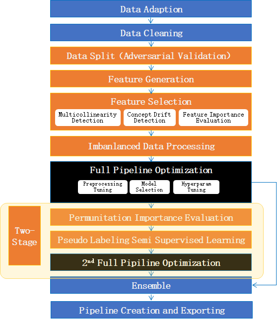

Experiment
================

Experiment is the playground to prepare training and testing data, and search the optimized estimator with HyperModel. Use experiment with the following steps:

* Prepare datasets

  * training data(X_train, y_train): required
  * evaluation data(X_eval, y_eval): optional, will be split from training data if not provided
  * testing data(X_test only): optional, the sample of the prediction data, is used to optimize the experiment

* Create HyperModel instance with your selected implementation

  * The `PlainModel` is provided as a plain implementation in this project.
  * More implementations can be found from `DeepTables <https://github.com/DataCanvasIO/DeepTables>`_, `HyperGBM <https://github.com/DataCanvasIO/HyperGBM>`_, `HyperKeras <https://github.com/DataCanvasIO/HyperKeras>`_, etc.

* Create experiment instance with the prepared datasets and HyperModel instance and other arguments required by your selected experiment implementation ( *GeneralExperiment* , *CompeteExperiment* , or your customized implementation).
* Call experiment's *.run()* to search the optimized estimator.

GeneralExperiment
-------------------------

GeneralExperiment the basic implementation of Experiment. Example:

.. code-block:: python

    from sklearn.model_selection import train_test_split

    from hypernets.experiment import GeneralExperiment
    from hypernets.searchers import make_searcher
    from hypernets.tabular.datasets import dsutils

    def create_hyper_model(reward_metric='auc', optimize_direction='max'):
        from hypernets.examples.plain_model import PlainModel, PlainSearchSpace

        search_space = PlainSearchSpace()
        searcher = make_searcher('random', search_space_fn=search_space, optimize_direction=optimize_direction)
        hyper_model = PlainModel(searcher=searcher, reward_metric=reward_metric, callbacks=[])

        return hyper_model

    def general_experiment_with_heart_disease():
        hyper_model = create_hyper_model()

        X = dsutils.load_heart_disease_uci()
        y = X.pop('target')

        X_train, X_test, y_train, y_test = train_test_split(X, y, test_size=0.3)

        experiment = GeneralExperiment(hyper_model, X_train, y_train, eval_size=0.3)
        estimator = experiment.run(max_trials=5)

        score = estimator.evaluate(X_test, y_test, metrics=['auc', 'accuracy', 'f1', 'recall', 'precision'])
        print('evaluate score:', score)

    if __name__ == '__main__':
        general_experiment_with_heart_disease()

CompeteExperiment
--------------------------------

CompeteExperiment is a implementation of experiment with many advanced features for tabular data, such as data cleaning, feature generation, feature selection, semi-supervised machine learning, two-stages searching etc.

Quick start
>>>>>>>>>>>>>>>>>>>>

Basically, use *CompeteExperiment* with default settings just like *GeneralExperiment*.

.. code-block:: python

    from sklearn.model_selection import train_test_split
    from sklearn.preprocessing import LabelEncoder

    from hypernets.experiment import CompeteExperiment
    from hypernets.tabular.datasets import dsutils
    from hypernets.tabular.metrics import calc_score

    def create_plain_model(reward_metric='auc', optimize_direction='max'):
        from hypernets.core.callbacks import SummaryCallback
        from hypernets.examples.plain_model import PlainModel, PlainSearchSpace
        from hypernets.searchers import make_searcher
        from hypernets.tabular.sklearn_ex import MultiLabelEncoder

        search_space = PlainSearchSpace(enable_dt=True, enable_lr=True, enable_nn=False)
        searcher = make_searcher('random', search_space_fn=search_space, optimize_direction=optimize_direction)
        hyper_model = PlainModel(searcher=searcher, reward_metric=reward_metric, callbacks=[SummaryCallback()],
                                 transformer=MultiLabelEncoder)

        return hyper_model

    def experiment_with_bank_data(row_count=3000):
        X = dsutils.load_bank()
        if row_count is not None:
            X = X.head(row_count)
        X['y'] = LabelEncoder().fit_transform(X['y'])
        y = X.pop('y')

        X_train, X_test, y_train, y_test = train_test_split(X, y, test_size=0.3, random_state=9527)

        experiment = CompeteExperiment(create_plain_model(), X_train, y_train, max_trials=10)
        estimator = experiment.run()

        preds = estimator.predict(X_test)
        proba = estimator.predict_proba(X_test)

        score = calc_score(y_test, preds, proba, metrics=['auc', 'accuracy', 'f1', 'recall', 'precision'])
        print('evaluate score:', score)
        assert score

    if __name__ == '__main__':
        experiment_with_bank_data()

Basic settings
>>>>>>>>>>>>>>>>>>>

TBD

Data cleaning
>>>>>>>>>>>>>>>>>>>>>>>>>>>>>>

TBD

