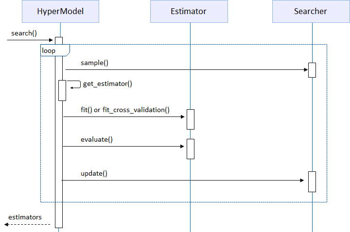

HyperModel
=============

HyperModel is an abstract class that needs to implement a dedicated HyperModel for different frameworks or domains. HyperModel explore hyper-parameters sample from Searcher, fit and evaluate Estimator, then reward the metric score to Searcher for optimization. The figure below shows HyperModel search sequence.

Customize HyperModel
-------------------------

To customize HyerModel, two components are required:

* HyperModel: subclass of *hypernets.model.HyperModel*, create newer Estimator instance with searched space sample, and load trained estimator from storage.

* Estimator: subclass of  *hypernets.model.Estimator*, the core component for model fitting/evaluation/prediction/persistence.

You can reference  *hypernets.examples.plain_model.PlainModel* and *hypernets.examples.plain_model.PlainEstimator* as start point. See `DeepTables <https://github.com/DataCanvasIO/DeepTables>`_, `HyperGBM <https://github.com/DataCanvasIO/HyperGBM>`_, `HyperKeras <https://github.com/DataCanvasIO/HyperKeras>`_ for more details.
