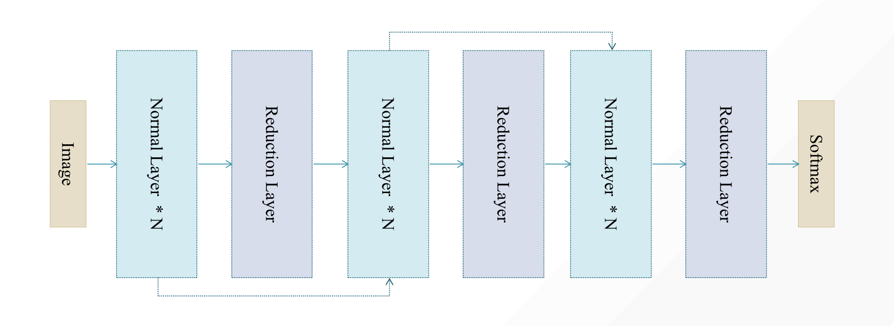

# Neural Architecture Search

Deep Learning has enabled remarkable progress over the last years on a variety of tasks, such as CV, NLP, and machine translation.  It is crucial to discover novel neural architectures, but currently it have mostly been developed manually by human experts.  Neural Architecture Search (NAS) has emerged as a promising tool to alleviate human effort in this trial and error design process.

NAS has demonstrated much success in automating neural network architecture design for various tasks, such as image recognition and language modeling. Representative works include NASNet, ENAS, DARTS, ProxylessNAS, One-Shot NAS, Regularized Evolution, AlphaX, etc.

However, most of these works are usually for specific use-cases, and their search space, search strategy and estimation strategy are often intertwined, making it difficult to reuse the code and make further innovations on it.

In Hypernets, we propose an abstract architecture, fully decouple Search Space, Search Strategy, and Performance Estimation Strategy so that each part is relatively independent and can be reused to accelerate innovations and engineering of NAS algorithms.


The 3 problems of NAS: Search Space, Search Strategy, and Performance Estimation Strategy,  which correspond to `HyperSpace`, `Searcher`, and `Estimator` in Hypernets respectively.

<p align="center">

</p>

## Define A DNN Search Space

```python
# define a DNN search space

from hypernets.frameworks.keras.layers import Dense, Input, BatchNormalization, Dropout, Activation
from hypernets.core.search_space import HyperSpace, Bool, Choice, Real, Dynamic
from hypernets.core.ops import Permutation, Sequential, Optional, Repeat
import itertools

def dnn_block(hp_dnn_units, hp_reduce_factor, hp_seq, hp_use_bn, hp_dropout, hp_activation, step):
    
    # The value of a `Dynamic` is computed as a function of the values of the ParameterSpace it depends on.
    block_units = Dynamic(
        lambda_fn=lambda units, reduce_factor: units if step == 0 else units * (reduce_factor ** step),
        units=hp_dnn_units, reduce_factor=hp_reduce_factor)

    dense = Dense(units=block_units)
    act = Activation(activation=hp_activation)
    optional_bn = Optional(BatchNormalization(), keep_link=True, hp_opt=hp_use_bn)
    dropout = Dropout(rate=hp_dropout)

    # Use `Permutation` to try different arrangements of act, optional_bn, dropout
    # optional_bn is optional module and will be skipped when hp_use_bn is False
    perm_act_bn_dropout = Permutation([act, optional_bn, dropout], hp_seq=hp_seq)
    
    # Use `Sequential` to connect dense and perm_act_bn_dropout in order
    seq = Sequential([dense, perm_act_bn_dropout])
    return seq


def dnn_search_space(input_shape, output_units, output_activation, units_choices=[200, 500, 1000],
                     reduce_facotr_choices=[1, 0.8, 0.5], layer_num_choices=[2, 3, 4],
                     activation_choices=['relu', 'tanh']):
    space = HyperSpace()
    with space.as_default():
        hp_dnn_units = Choice(units_choices)
        hp_reduce_factor = Choice(reduce_facotr_choices)
        hp_use_bn = Bool()
        if len(activation_choices) == 1:
            hp_activation = activation_choices[0]
        else:
            hp_activation = Choice(activation_choices)

        hp_dropout = Real(0., 0.5, step=0.1)
        hp_seq = Choice([seq for seq in itertools.permutations(range(3))])

        input = Input(shape=input_shape)
        backbone = Repeat(
            lambda step: dnn_block(hp_dnn_units, hp_reduce_factor, hp_seq, hp_use_bn, hp_dropout, hp_activation, step),
            repeat_num_choices=layer_num_choices)(input)
        output = Dense(units=output_units, activation=output_activation)(backbone)
    return space


# Search the best model in search space defined above 
from hypernets.searchers.random_searcher import RandomSearcher
from hypernets.core.callbacks import SummaryCallback
from hypernets.frameworks.keras.models import HyperKeras
import numpy as np

rs = RandomSearcher(lambda: dnn_search_space(input_shape=10, output_units=2, output_activation='sigmoid'),
                    optimize_direction='max')
hk = HyperKeras(rs, optimizer='adam', loss='sparse_categorical_crossentropy', metrics=['accuracy'],
                callbacks=[SummaryCallback()])

x = np.random.randint(0, 10000, size=(100, 10))
y = np.random.randint(0, 2, size=(100), dtype='int')

hk.search(x, y, x, y, max_trails=3)
assert hk.best_model
```

## Define A CNN Search Space
```python
from hypernets.frameworks.keras.layers import Dense, Input, BatchNormalization, Activation, \
    Conv2D, MaxPooling2D, AveragePooling2D, Flatten
from hypernets.core.search_space import HyperSpace, Bool, Choice, Dynamic
from hypernets.core.ops import Permutation, Sequential, Optional, Repeat, Or
import itertools


def conv_block(block_no, hp_pooling, hp_filters, hp_kernel_size, hp_bn_act, hp_use_bn, hp_activation, strides=(1, 1)):
    def conv_bn(step):
        conv = Conv2D(filters=conv_filters, kernel_size=hp_kernel_size, strides=strides, padding='same')
        act = Activation(activation=hp_activation)
        optional_bn = Optional(BatchNormalization(), keep_link=True, hp_opt=hp_use_bn)

        # Use `Permutation` to try different arrangements of act, optional_bn
        # optional_bn is optional module and will be skipped when hp_use_bn is False
        perm_act_bn = Permutation([optional_bn, act], hp_seq=hp_bn_act)
        seq = Sequential([conv, perm_act_bn])
        return seq

    if block_no < 2:
        repeat_num_choices = [2]
        multiplier = 1
    else:
        repeat_num_choices = [3, 4, 5]
        multiplier = 2 ** (block_no - 1)

    conv_filters = Dynamic(lambda filters: filters * multiplier, filters=hp_filters)
    conv = Repeat(conv_bn, repeat_num_choices=repeat_num_choices)
    pooling = Or([MaxPooling2D(padding='same'), AveragePooling2D(padding='same')], hp_or=hp_pooling)
    block = Sequential([conv, pooling])
    return block


def cnn_search_space(input_shape, output_units, output_activation='softmax', block_num_choices=[2, 3, 4, 5, 6],
                     activation_choices=['relu'], filters_choices=[32, 64], kernel_size_choices=[(1, 1), (3, 3)]):
    space = HyperSpace()
    with space.as_default():
        hp_use_bn = Bool()
        hp_pooling = Choice(list(range(2)))
        hp_filters = Choice(filters_choices)
        hp_kernel_size = Choice(kernel_size_choices)
        hp_fc_units = Choice([1024, 2048, 4096])
        if len(activation_choices) == 1:
            hp_activation = activation_choices[0]
        else:
            hp_activation = Choice(activation_choices)
        hp_bn_act = Choice([seq for seq in itertools.permutations(range(2))])

        input = Input(shape=input_shape)
        blocks = Repeat(
            lambda step: conv_block(
                block_no=step,
                hp_pooling=hp_pooling,
                hp_filters=hp_filters,
                hp_kernel_size=hp_kernel_size,
                hp_use_bn=hp_use_bn,
                hp_activation=hp_activation,
                hp_bn_act=hp_bn_act),
            repeat_num_choices=block_num_choices)(input)
        x = Flatten()(blocks)
        x = Dense(units=hp_fc_units, activation=hp_activation, name='fc1')(x)
        x = Dense(units=hp_fc_units, activation=hp_activation, name='fc2')(x)
        x = Dense(output_units, activation=output_activation, name='predictions')(x)
    return space


# Search the best model in search space defined above on mnist dataset

from hypernets.searchers.random_searcher import RandomSearcher
from hypernets.core.callbacks import SummaryCallback
from hypernets.frameworks.keras.models import HyperKeras
import numpy as np
import tensorflow as tf

rs = RandomSearcher(
    lambda: cnn_search_space(input_shape=(28, 28, 1),
                             output_units=10,
                             output_activation='softmax',
                             block_num_choices=[2, 3, 4, 5],
                             filters_choices=[32, 64, 128],
                             kernel_size_choices=[(1, 1), (3, 3)]),
    optimize_direction='max')
hk = HyperKeras(rs, optimizer='adam', loss='categorical_crossentropy', metrics=['accuracy'],
                callbacks=[SummaryCallback()])

(x_train, y_train), (x_test, y_test) = tf.keras.datasets.mnist.load_data()

# Rescale the images from [0,255] to the [0.0,1.0] range.
x_train, x_test = x_train[..., np.newaxis] / 255.0, x_test[..., np.newaxis] / 255.0
y_train = tf.keras.utils.to_categorical(y_train)
y_test = tf.keras.utils.to_categorical(y_test)

hk.search(x_train, y_train, x_test, y_test, max_trails=10, epochs=10)
assert hk.best_model
```

## Define An ENAS Micro Search Space




* illastration of ENAS 

```python
# define an ENAS micro search space

from hypernets.frameworks.keras.enas_layers import SafeConcatenate, Identity, CalibrateSize
from hypernets.frameworks.keras.layers import BatchNormalization, Activation, Add, MaxPooling2D, AveragePooling2D, \
    SeparableConv2D, Conv2D, GlobalAveragePooling2D, Dense, Dropout
from hypernets.core.ops import Or, InputChoice, ConnectLooseEnd
from hypernets.core.search_space import ModuleSpace


def sepconv2d_bn(no, name_prefix, kernel_size, filters, strides=(1, 1), data_format=None, x=None):
    relu = Activation(activation='relu', name=f'{name_prefix}relu_{no}_')
    if x is not None and isinstance(x, ModuleSpace):
        relu(x)
    sepconv2d = SeparableConv2D(
        filters=filters,
        kernel_size=kernel_size,
        strides=strides,
        padding='same',
        data_format=data_format,
        name=f'{name_prefix}sepconv2d_{no}'
    )(relu)
    bn = BatchNormalization(name=f'{name_prefix}bn_{no}_')(sepconv2d)
    return bn


def sepconv3x3(name_prefix, filters, strides=(1, 1), data_format=None):
    name_prefix = name_prefix + 'sepconv3x3_'
    sep1 = sepconv2d_bn(0, name_prefix, kernel_size=(3, 3), filters=filters, strides=strides, data_format=data_format)
    sep2 = sepconv2d_bn(1, name_prefix, kernel_size=(3, 3), filters=filters, strides=strides, data_format=data_format,
                        x=sep1)
    return sep2


def sepconv5x5(name_prefix, filters, strides=(1, 1), data_format=None):
    name_prefix = name_prefix + 'sepconv5x5_'
    sep1 = sepconv2d_bn(0, name_prefix, kernel_size=(5, 5), filters=filters, strides=strides, data_format=data_format)
    sep2 = sepconv2d_bn(1, name_prefix, kernel_size=(5, 5), filters=filters, strides=strides, data_format=data_format,
                        x=sep1)
    return sep2


def maxpooling3x3(name_prefix, filters, strides=(1, 1), data_format=None):
    name_prefix = name_prefix + 'maxpooling3x3_'
    max = MaxPooling2D(pool_size=(3, 3), strides=strides, padding='same', data_format=data_format,
                       name=f'{name_prefix}pool_')
    return max


def avgpooling3x3(name_prefix, filters, strides=(1, 1), data_format=None):
    name_prefix = name_prefix + 'avgpooling3x3_'
    avg = AveragePooling2D(pool_size=(3, 3), strides=strides, padding='same', data_format=data_format,
                           name=f'{name_prefix}pool_')
    return avg


def identity(name_prefix):
    return Identity(name=f'{name_prefix}identity')


def add(x1, x2, name_prefix, filters):
    return Add(name=f'{name_prefix}add_')([x1, x2])


def conv_cell(hp_dict, type, cell_no, node_no, left_or_right, inputs, filters, is_reduction=False, data_format=None):
    assert isinstance(inputs, list)
    assert all([isinstance(m, ModuleSpace) for m in inputs])
    name_prefix = f'{type}_C{cell_no}_N{node_no}_{left_or_right}_'

    input_choice_key = f'{type[2:]}_N{node_no}_{left_or_right}_input_choice'
    op_choice_key = f'{type[2:]}_N{node_no}_{left_or_right}_op_choice'
    hp_choice = hp_dict.get(input_choice_key)
    ic1 = InputChoice(inputs, 1, hp_choice=hp_choice)(inputs)
    if hp_choice is None:
        hp_dict[input_choice_key] = ic1.hp_choice

    # hp_strides = Dynamic(lambda_fn=lambda choice: (2, 2) if is_reduction and choice[0] <= 1 else (1, 1),
    #                      choice=ic1.hp_choice)
    hp_strides = (1, 1)
    hp_or = hp_dict.get(op_choice_key)
    or1 = Or([sepconv5x5(name_prefix, filters, strides=hp_strides, data_format=data_format),
              sepconv3x3(name_prefix, filters, strides=hp_strides, data_format=data_format),
              avgpooling3x3(name_prefix, filters, strides=hp_strides, data_format=data_format),
              maxpooling3x3(name_prefix, filters, strides=hp_strides, data_format=data_format),
              identity(name_prefix)], hp_or=hp_or)(ic1)

    if hp_or is None:
        hp_dict[op_choice_key] = or1.hp_or

    return or1


def conv_node(hp_dict, type, cell_no, node_no, inputs, filters, is_reduction=False, data_format=None):
    op_left = conv_cell(hp_dict, type, cell_no, node_no, 'L', inputs, filters, is_reduction, data_format)
    op_right = conv_cell(hp_dict, type, cell_no, node_no, 'R', inputs, filters, is_reduction, data_format)
    name_prefix = f'{type}_C{cell_no}_N{node_no}_'
    return add(op_left, op_right, name_prefix, filters)


def conv_layer(hp_dict, type, cell_no, inputs, filters, node_num, is_reduction=False, data_format=None):
    name_prefix = f'{type}_C{cell_no}_'

    if inputs[0] == inputs[1]:
        c1 = c2 = CalibrateSize(0, filters, name_prefix, data_format)(inputs[0])
    else:
        c1 = CalibrateSize(0, filters, name_prefix, data_format)(inputs)
        c2 = CalibrateSize(1, filters, name_prefix, data_format)(inputs)
    inputs = [c1, c2]
    all_nodes = [c1, c2]
    for node_no in range(node_num):
        node = conv_node(hp_dict, type, cell_no, node_no, inputs, filters, is_reduction, data_format)
        inputs.append(node)
        all_nodes.append(node)
    cle = ConnectLooseEnd(all_nodes)(all_nodes)
    concat = SafeConcatenate(filters, name_prefix, name=name_prefix + 'concat_')(cle)
    return concat


def stem_op(input, filters, data_format=None):
    conv = Conv2D(
        filters=filters * 3,
        kernel_size=(3, 3),
        strides=(1, 1),
        padding='same',
        data_format=data_format,
        name=f'0_stem_conv2d'
    )(input)
    bn = BatchNormalization(name=f'0_stem_bn')(conv)
    return bn


def auxiliary_head():
    pass


def classfication(x, classes, dropout_rate=0, data_format=None):
    x = Activation('relu')(x)
    x = GlobalAveragePooling2D(data_format=data_format)(x)
    if dropout_rate > 0:
        x = Dropout(dropout_rate)(x)
    x = Dense(classes, activation='softmax')(x)
    return x


from hypernets.frameworks.keras.enas_common_ops import *
from hypernets.frameworks.keras.layers import Input
from hypernets.frameworks.keras.enas_layers import FactorizedReduction
from hypernets.core.search_space import HyperSpace

def enas_micro_search_space(arch='NRNR', input_shape=(28, 28, 1), init_filters=64, 
                            node_num=4, data_format=None,
                            classes=10, classification_dropout=0,
                            hp_dict={}):
    space = HyperSpace()
    with space.as_default():
        input = Input(shape=input_shape, name='0_input')
        stem = stem_op(input, init_filters, data_format)
        node0 = stem
        node1 = stem
        # node0 = input
        # node1 = input
        reduction_no = 0
        normal_no = 0

        for l in arch:
            if l == 'N':
                normal_no += 1
                type = 'normal'
                cell_no = normal_no
                is_reduction = False
            else:
                reduction_no += 1
                type = 'reduction'
                cell_no = reduction_no
                is_reduction = True
            filters = (2 ** reduction_no) * init_filters

            if is_reduction:
                node0 = node1
                node1 = FactorizedReduction(filters, f'{type}_C{cell_no}_', data_format)(node1)
            x = conv_layer(hp_dict, f'{normal_no + reduction_no}_{type}', cell_no, [node0, node1], filters, node_num,
                           is_reduction)
            node0 = node1
            node1 = x
        logit = classfication(x, classes, classification_dropout, data_format)
        space.set_inputs(input)
    return space


# Search the best model in search space defined above on mnist dataset
import tensorflow as tf

from hypernets.core.callbacks import SummaryCallback
from hypernets.core.ops import *
from hypernets.frameworks.keras.enas_micro import enas_micro_search_space
from hypernets.frameworks.keras.models import HyperKeras
from hypernets.searchers.random_searcher import RandomSearcher

rs = RandomSearcher(
    lambda: enas_micro_search_space(arch='NR', hp_dict={}),
    optimize_direction='max')
hk = HyperKeras(rs, optimizer='adam', loss='categorical_crossentropy', metrics=['accuracy'],
                callbacks=[SummaryCallback()])

(x_train, y_train), (x_test, y_test) = tf.keras.datasets.mnist.load_data()

# Rescale the images from [0,255] to the [0.0,1.0] range.
x_train, x_test = x_train[..., np.newaxis] / 255.0, x_test[..., np.newaxis] / 255.0
y_train = tf.keras.utils.to_categorical(y_train)
y_test = tf.keras.utils.to_categorical(y_test)
print("Number of original training examples:", len(x_train))
print("Number of original test examples:", len(x_test))

# sample for speed up
samples = 10000
hk.search(x_train[:samples], y_train[:samples], x_test[:int(samples / 10)], y_test[:int(samples / 10)],
          max_trails=10, epochs=3)
assert hk.best_model
```

```log
/Users/jack/opt/anaconda3/envs/hypernets/bin/python /Users/jack/workspace/aps/Hypernets/tests/keras/run_enas.py
/Users/jack/opt/anaconda3/envs/hypernets/lib/python3.6/site-packages/lightgbm/__init__.py:48: UserWarning: Starting from version 2.2.1, the library file in distribution wheels for macOS is built by the Apple Clang (Xcode_8.3.3) compiler.
This means that in case of installing LightGBM from PyPI via the ``pip install lightgbm`` command, you don't need to install the gcc compiler anymore.
Instead of that, you need to install the OpenMP library, which is required for running LightGBM on the system with the Apple Clang compiler.
You can install the OpenMP library by the following command: ``brew install libomp``.
  "You can install the OpenMP library by the following command: ``brew install libomp``.", UserWarning)
Number of original training examples: 60000
Number of original test examples: 10000
Initialize Meta Learner: dataset_id:(10000, 28, 28, 1)
2020-07-09 12:39:44.508558: I tensorflow/core/platform/cpu_feature_guard.cc:142] Your CPU supports instructions that this TensorFlow binary was not compiled to use: AVX2 FMA
2020-07-09 12:39:44.524010: I tensorflow/compiler/xla/service/service.cc:168] XLA service 0x7fedc7d8bc50 initialized for platform Host (this does not guarantee that XLA will be used). Devices:
2020-07-09 12:39:44.524026: I tensorflow/compiler/xla/service/service.cc:176]   StreamExecutor device (0): Host, Default Version

Trail No:1

--------------------------------------------------------------
(0) Module_InputChoice_1.hp_choice:                       [0]
(1) Module_InputChoice_2.hp_choice:                       [0]
(2) Module_Or_1.hp_or:                                      1
(3) Module_Or_2.hp_or:                                      1
(4) Module_InputChoice_3.hp_choice:                       [1]
(5) Module_InputChoice_4.hp_choice:                       [2]
(6) Module_Or_3.hp_or:                                      1
(7) Module_Or_4.hp_or:                                      3
(8) Module_InputChoice_5.hp_choice:                       [1]
(9) Module_InputChoice_6.hp_choice:                       [2]
(10) Module_Or_5.hp_or:                                     1
(11) Module_Or_6.hp_or:                                     2
(12) Module_InputChoice_7.hp_choice:                      [1]
(13) Module_InputChoice_8.hp_choice:                      [0]
(14) Module_Or_7.hp_or:                                     3
(15) Module_Or_8.hp_or:                                     1
(16) Module_InputChoice_10.hp_choice:                     [1]
(17) Module_InputChoice_9.hp_choice:                      [0]
(18) Module_Or_10.hp_or:                                    0
(19) Module_Or_9.hp_or:                                     4
(20) Module_InputChoice_11.hp_choice:                     [2]
(21) Module_InputChoice_12.hp_choice:                     [0]
(22) Module_Or_11.hp_or:                                    1
(23) Module_Or_12.hp_or:                                    4
(24) Module_InputChoice_13.hp_choice:                     [2]
(25) Module_InputChoice_14.hp_choice:                     [3]
(26) Module_Or_13.hp_or:                                    1
(27) Module_Or_14.hp_or:                                    3
(28) Module_InputChoice_15.hp_choice:                     [2]
(29) Module_InputChoice_16.hp_choice:                     [1]
(30) Module_Or_15.hp_or:                                    3
(31) Module_Or_16.hp_or:                                    0
--------------------------------------------------------------
Model: "model"
__________________________________________________________________________________________________
Layer (type)                    Output Shape         Param #     Connected to                     
==================================================================================================
0_input (InputLayer)            [(None, 28, 28, 1)]  0                                            
__________________________________________________________________________________________________
0_stem_conv2d (Conv2D)          (None, 28, 28, 192)  1920        0_input[0][0]                    
__________________________________________________________________________________________________
0_stem_bn (BatchNormalization)  (None, 28, 28, 192)  768         0_stem_conv2d[0][0]              
__________________________________________________________________________________________________
1_normal_C1_input0_filters_alig (None, 28, 28, 192)  0           0_stem_bn[0][0]                  
__________________________________________________________________________________________________
1_normal_C1_input0_filters_alig (None, 28, 28, 64)   12352       1_normal_C1_input0_filters_aligni
__________________________________________________________________________________________________
1_normal_C1_input0_filters_alig (None, 28, 28, 64)   256         1_normal_C1_input0_filters_aligni
__________________________________________________________________________________________________
1_normal_C1_N0_L_sepconv3x3_rel (None, 28, 28, 64)   0           1_normal_C1_input0_filters_aligni
__________________________________________________________________________________________________
1_normal_C1_N0_R_sepconv3x3_rel (None, 28, 28, 64)   0           1_normal_C1_input0_filters_aligni
__________________________________________________________________________________________________
1_normal_C1_N0_L_sepconv3x3_sep (None, 28, 28, 64)   4736        1_normal_C1_N0_L_sepconv3x3_relu_
__________________________________________________________________________________________________
1_normal_C1_N0_R_sepconv3x3_sep (None, 28, 28, 64)   4736        1_normal_C1_N0_R_sepconv3x3_relu_
__________________________________________________________________________________________________
1_normal_C1_N1_L_sepconv3x3_rel (None, 28, 28, 64)   0           1_normal_C1_input0_filters_aligni
__________________________________________________________________________________________________
1_normal_C1_N0_L_sepconv3x3_bn_ (None, 28, 28, 64)   256         1_normal_C1_N0_L_sepconv3x3_sepco
__________________________________________________________________________________________________
1_normal_C1_N0_R_sepconv3x3_bn_ (None, 28, 28, 64)   256         1_normal_C1_N0_R_sepconv3x3_sepco
__________________________________________________________________________________________________
1_normal_C1_N2_L_sepconv3x3_rel (None, 28, 28, 64)   0           1_normal_C1_input0_filters_aligni
__________________________________________________________________________________________________
1_normal_C1_N3_R_sepconv3x3_rel (None, 28, 28, 64)   0           1_normal_C1_input0_filters_aligni
__________________________________________________________________________________________________
1_normal_C1_N1_L_sepconv3x3_sep (None, 28, 28, 64)   4736        1_normal_C1_N1_L_sepconv3x3_relu_
__________________________________________________________________________________________________
1_normal_C1_N0_L_sepconv3x3_rel (None, 28, 28, 64)   0           1_normal_C1_N0_L_sepconv3x3_bn_0_
__________________________________________________________________________________________________
1_normal_C1_N0_R_sepconv3x3_rel (None, 28, 28, 64)   0           1_normal_C1_N0_R_sepconv3x3_bn_0_
__________________________________________________________________________________________________
1_normal_C1_N2_L_sepconv3x3_sep (None, 28, 28, 64)   4736        1_normal_C1_N2_L_sepconv3x3_relu_
__________________________________________________________________________________________________
1_normal_C1_N3_R_sepconv3x3_sep (None, 28, 28, 64)   4736        1_normal_C1_N3_R_sepconv3x3_relu_
__________________________________________________________________________________________________
1_normal_C1_N1_L_sepconv3x3_bn_ (None, 28, 28, 64)   256         1_normal_C1_N1_L_sepconv3x3_sepco
__________________________________________________________________________________________________
1_normal_C1_N0_L_sepconv3x3_sep (None, 28, 28, 64)   4736        1_normal_C1_N0_L_sepconv3x3_relu_
__________________________________________________________________________________________________
1_normal_C1_N0_R_sepconv3x3_sep (None, 28, 28, 64)   4736        1_normal_C1_N0_R_sepconv3x3_relu_
__________________________________________________________________________________________________
1_normal_C1_N2_L_sepconv3x3_bn_ (None, 28, 28, 64)   256         1_normal_C1_N2_L_sepconv3x3_sepco
__________________________________________________________________________________________________
1_normal_C1_N3_R_sepconv3x3_bn_ (None, 28, 28, 64)   256         1_normal_C1_N3_R_sepconv3x3_sepco
__________________________________________________________________________________________________
1_normal_C1_N1_L_sepconv3x3_rel (None, 28, 28, 64)   0           1_normal_C1_N1_L_sepconv3x3_bn_0_
__________________________________________________________________________________________________
1_normal_C1_N0_L_sepconv3x3_bn_ (None, 28, 28, 64)   256         1_normal_C1_N0_L_sepconv3x3_sepco
__________________________________________________________________________________________________
1_normal_C1_N0_R_sepconv3x3_bn_ (None, 28, 28, 64)   256         1_normal_C1_N0_R_sepconv3x3_sepco
__________________________________________________________________________________________________
1_normal_C1_N2_L_sepconv3x3_rel (None, 28, 28, 64)   0           1_normal_C1_N2_L_sepconv3x3_bn_0_
__________________________________________________________________________________________________
1_normal_C1_N3_R_sepconv3x3_rel (None, 28, 28, 64)   0           1_normal_C1_N3_R_sepconv3x3_bn_0_
__________________________________________________________________________________________________
1_normal_C1_N1_L_sepconv3x3_sep (None, 28, 28, 64)   4736        1_normal_C1_N1_L_sepconv3x3_relu_
__________________________________________________________________________________________________
1_normal_C1_N0_add_ (Add)       (None, 28, 28, 64)   0           1_normal_C1_N0_L_sepconv3x3_bn_1_
                                                                 1_normal_C1_N0_R_sepconv3x3_bn_1_
__________________________________________________________________________________________________
1_normal_C1_N2_L_sepconv3x3_sep (None, 28, 28, 64)   4736        1_normal_C1_N2_L_sepconv3x3_relu_
__________________________________________________________________________________________________
1_normal_C1_N3_R_sepconv3x3_sep (None, 28, 28, 64)   4736        1_normal_C1_N3_R_sepconv3x3_relu_
__________________________________________________________________________________________________
1_normal_C1_N1_L_sepconv3x3_bn_ (None, 28, 28, 64)   256         1_normal_C1_N1_L_sepconv3x3_sepco
__________________________________________________________________________________________________
1_normal_C1_N1_R_maxpooling3x3_ (None, 28, 28, 64)   0           1_normal_C1_N0_add_[0][0]        
__________________________________________________________________________________________________
1_normal_C1_N2_L_sepconv3x3_bn_ (None, 28, 28, 64)   256         1_normal_C1_N2_L_sepconv3x3_sepco
__________________________________________________________________________________________________
1_normal_C1_N2_R_avgpooling3x3_ (None, 28, 28, 64)   0           1_normal_C1_N0_add_[0][0]        
__________________________________________________________________________________________________
1_normal_C1_N3_L_maxpooling3x3_ (None, 28, 28, 64)   0           1_normal_C1_input0_filters_aligni
__________________________________________________________________________________________________
1_normal_C1_N3_R_sepconv3x3_bn_ (None, 28, 28, 64)   256         1_normal_C1_N3_R_sepconv3x3_sepco
__________________________________________________________________________________________________
1_normal_C1_N1_add_ (Add)       (None, 28, 28, 64)   0           1_normal_C1_N1_L_sepconv3x3_bn_1_
                                                                 1_normal_C1_N1_R_maxpooling3x3_po
__________________________________________________________________________________________________
1_normal_C1_N2_add_ (Add)       (None, 28, 28, 64)   0           1_normal_C1_N2_L_sepconv3x3_bn_1_
                                                                 1_normal_C1_N2_R_avgpooling3x3_po
__________________________________________________________________________________________________
1_normal_C1_N3_add_ (Add)       (None, 28, 28, 64)   0           1_normal_C1_N3_L_maxpooling3x3_po
                                                                 1_normal_C1_N3_R_sepconv3x3_bn_1_
__________________________________________________________________________________________________
1_normal_C1_concat_ (Concatenat (None, 28, 28, 192)  0           1_normal_C1_N1_add_[0][0]        
                                                                 1_normal_C1_N2_add_[0][0]        
                                                                 1_normal_C1_N3_add_[0][0]        
__________________________________________________________________________________________________
reduction_C1_relu_ (ReLU)       (None, 28, 28, 192)  0           1_normal_C1_concat_[0][0]        
__________________________________________________________________________________________________
reduction_C1_reduction_zeropad2 (None, 29, 29, 192)  0           reduction_C1_relu_[0][0]         
__________________________________________________________________________________________________
reduction_C1_reduction_crop2d_b (None, 28, 28, 192)  0           reduction_C1_reduction_zeropad2d_
__________________________________________________________________________________________________
reduction_C1_reduction_avepool2 (None, 14, 14, 192)  0           reduction_C1_relu_[0][0]         
__________________________________________________________________________________________________
reduction_C1_reduction_avepool2 (None, 14, 14, 192)  0           reduction_C1_reduction_crop2d_b_[
__________________________________________________________________________________________________
reduction_C1_reduction_conv2d_a (None, 14, 14, 64)   12352       reduction_C1_reduction_avepool2d_
__________________________________________________________________________________________________
reduction_C1_reduction_conv2d_b (None, 14, 14, 64)   12352       reduction_C1_reduction_avepool2d_
__________________________________________________________________________________________________
reduction_C1_reduction_concat_  (None, 14, 14, 128)  0           reduction_C1_reduction_conv2d_a_[
                                                                 reduction_C1_reduction_conv2d_b_[
__________________________________________________________________________________________________
2_reduction_C1_relu_ (ReLU)     (None, 28, 28, 192)  0           1_normal_C1_concat_[0][0]        
__________________________________________________________________________________________________
reduction_C1_reduction_bn_ (Bat (None, 14, 14, 128)  512         reduction_C1_reduction_concat_[0]
__________________________________________________________________________________________________
2_reduction_C1_input0_factorize (None, 29, 29, 192)  0           2_reduction_C1_relu_[0][0]       
__________________________________________________________________________________________________
2_reduction_C1_N0_R_sepconv5x5_ (None, 14, 14, 128)  0           reduction_C1_reduction_bn_[0][0] 
__________________________________________________________________________________________________
2_reduction_C1_input0_factorize (None, 28, 28, 192)  0           2_reduction_C1_input0_factorized_
__________________________________________________________________________________________________
2_reduction_C1_N0_R_sepconv5x5_ (None, 14, 14, 128)  19712       2_reduction_C1_N0_R_sepconv5x5_re
__________________________________________________________________________________________________
2_reduction_C1_input0_factorize (None, 14, 14, 192)  0           2_reduction_C1_relu_[0][0]       
__________________________________________________________________________________________________
2_reduction_C1_input0_factorize (None, 14, 14, 192)  0           2_reduction_C1_input0_factorized_
__________________________________________________________________________________________________
2_reduction_C1_N0_R_sepconv5x5_ (None, 14, 14, 128)  512         2_reduction_C1_N0_R_sepconv5x5_se
__________________________________________________________________________________________________
2_reduction_C1_input0_factorize (None, 14, 14, 64)   12352       2_reduction_C1_input0_factorized_
__________________________________________________________________________________________________
2_reduction_C1_input0_factorize (None, 14, 14, 64)   12352       2_reduction_C1_input0_factorized_
__________________________________________________________________________________________________
2_reduction_C1_N0_R_sepconv5x5_ (None, 14, 14, 128)  0           2_reduction_C1_N0_R_sepconv5x5_bn
__________________________________________________________________________________________________
2_reduction_C1_input0_factorize (None, 14, 14, 128)  0           2_reduction_C1_input0_factorized_
                                                                 2_reduction_C1_input0_factorized_
__________________________________________________________________________________________________
2_reduction_C1_N0_R_sepconv5x5_ (None, 14, 14, 128)  19712       2_reduction_C1_N0_R_sepconv5x5_re
__________________________________________________________________________________________________
2_reduction_C1_input0_factorize (None, 14, 14, 128)  512         2_reduction_C1_input0_factorized_
__________________________________________________________________________________________________
2_reduction_C1_N0_R_sepconv5x5_ (None, 14, 14, 128)  512         2_reduction_C1_N0_R_sepconv5x5_se
__________________________________________________________________________________________________
2_reduction_C1_N0_add_ (Add)    (None, 14, 14, 128)  0           2_reduction_C1_input0_factorized_
                                                                 2_reduction_C1_N0_R_sepconv5x5_bn
__________________________________________________________________________________________________
2_reduction_C1_N1_L_sepconv3x3_ (None, 14, 14, 128)  0           2_reduction_C1_N0_add_[0][0]     
__________________________________________________________________________________________________
2_reduction_C1_N1_L_sepconv3x3_ (None, 14, 14, 128)  17664       2_reduction_C1_N1_L_sepconv3x3_re
__________________________________________________________________________________________________
2_reduction_C1_N2_L_sepconv3x3_ (None, 14, 14, 128)  0           2_reduction_C1_N0_add_[0][0]     
__________________________________________________________________________________________________
2_reduction_C1_N1_L_sepconv3x3_ (None, 14, 14, 128)  512         2_reduction_C1_N1_L_sepconv3x3_se
__________________________________________________________________________________________________
2_reduction_C1_N3_R_sepconv5x5_ (None, 14, 14, 128)  0           reduction_C1_reduction_bn_[0][0] 
__________________________________________________________________________________________________
2_reduction_C1_N2_L_sepconv3x3_ (None, 14, 14, 128)  17664       2_reduction_C1_N2_L_sepconv3x3_re
__________________________________________________________________________________________________
2_reduction_C1_N1_L_sepconv3x3_ (None, 14, 14, 128)  0           2_reduction_C1_N1_L_sepconv3x3_bn
__________________________________________________________________________________________________
2_reduction_C1_N3_R_sepconv5x5_ (None, 14, 14, 128)  19712       2_reduction_C1_N3_R_sepconv5x5_re
__________________________________________________________________________________________________
2_reduction_C1_N2_L_sepconv3x3_ (None, 14, 14, 128)  512         2_reduction_C1_N2_L_sepconv3x3_se
__________________________________________________________________________________________________
2_reduction_C1_N1_L_sepconv3x3_ (None, 14, 14, 128)  17664       2_reduction_C1_N1_L_sepconv3x3_re
__________________________________________________________________________________________________
2_reduction_C1_N3_R_sepconv5x5_ (None, 14, 14, 128)  512         2_reduction_C1_N3_R_sepconv5x5_se
__________________________________________________________________________________________________
2_reduction_C1_N2_L_sepconv3x3_ (None, 14, 14, 128)  0           2_reduction_C1_N2_L_sepconv3x3_bn
__________________________________________________________________________________________________
2_reduction_C1_N1_L_sepconv3x3_ (None, 14, 14, 128)  512         2_reduction_C1_N1_L_sepconv3x3_se
__________________________________________________________________________________________________
2_reduction_C1_N3_R_sepconv5x5_ (None, 14, 14, 128)  0           2_reduction_C1_N3_R_sepconv5x5_bn
__________________________________________________________________________________________________
2_reduction_C1_N2_L_sepconv3x3_ (None, 14, 14, 128)  17664       2_reduction_C1_N2_L_sepconv3x3_re
__________________________________________________________________________________________________
2_reduction_C1_N1_add_ (Add)    (None, 14, 14, 128)  0           2_reduction_C1_N1_L_sepconv3x3_bn
                                                                 2_reduction_C1_input0_factorized_
__________________________________________________________________________________________________
2_reduction_C1_N3_R_sepconv5x5_ (None, 14, 14, 128)  19712       2_reduction_C1_N3_R_sepconv5x5_re
__________________________________________________________________________________________________
2_reduction_C1_N2_L_sepconv3x3_ (None, 14, 14, 128)  512         2_reduction_C1_N2_L_sepconv3x3_se
__________________________________________________________________________________________________
2_reduction_C1_N2_R_maxpooling3 (None, 14, 14, 128)  0           2_reduction_C1_N1_add_[0][0]     
__________________________________________________________________________________________________
2_reduction_C1_N3_L_maxpooling3 (None, 14, 14, 128)  0           2_reduction_C1_N0_add_[0][0]     
__________________________________________________________________________________________________
2_reduction_C1_N3_R_sepconv5x5_ (None, 14, 14, 128)  512         2_reduction_C1_N3_R_sepconv5x5_se
__________________________________________________________________________________________________
2_reduction_C1_N2_add_ (Add)    (None, 14, 14, 128)  0           2_reduction_C1_N2_L_sepconv3x3_bn
                                                                 2_reduction_C1_N2_R_maxpooling3x3
__________________________________________________________________________________________________
2_reduction_C1_N3_add_ (Add)    (None, 14, 14, 128)  0           2_reduction_C1_N3_L_maxpooling3x3
                                                                 2_reduction_C1_N3_R_sepconv5x5_bn
__________________________________________________________________________________________________
2_reduction_C1_concat_ (Concate (None, 14, 14, 256)  0           2_reduction_C1_N2_add_[0][0]     
                                                                 2_reduction_C1_N3_add_[0][0]     
__________________________________________________________________________________________________
Module_Activation_1 (Activation (None, 14, 14, 256)  0           2_reduction_C1_concat_[0][0]     
__________________________________________________________________________________________________
Module_GlobalAveragePooling2D_1 (None, 256)          0           Module_Activation_1[0][0]        
__________________________________________________________________________________________________
Module_Dense_1 (Dense)          (None, 10)           2570        Module_GlobalAveragePooling2D_1[0
==================================================================================================
Total params: 271,818
Trainable params: 267,466
Non-trainable params: 4,352
__________________________________________________________________________________________________
trail begin
Train on 10000 samples
Epoch 1/3
10000/10000 [==============================] - 322s 32ms/sample - loss: 0.3171 - accuracy: 0.9157
Epoch 2/3
10000/10000 [==============================] - 321s 32ms/sample - loss: 0.0870 - accuracy: 0.9755
Epoch 3/3
10000/10000 [==============================] - 319s 32ms/sample - loss: 0.0584 - accuracy: 0.9825
1000/1000 [==============================] - 8s 8ms/sample - loss: 0.3346 - accuracy: 0.8820
trail end. reward:0.8820000290870667, improved:True, elapsed:971.3707249164581
Total elapsed:971.4891712665558
----------------------------------------------------------------
space signatures: {'76001d37233837206b28fd9999cb2e75'}
----------------------------------------------------------------

Trail No:2
......
```
## API Reference

```python
# api

```


References

[1] Pham H, Guan M Y, Zoph B, et al. Efficient neural architecture search via parameter sharing[J]. arXiv preprint arXiv:1802.03268, 2018.

[2] Elsken T, Metzen J H, Hutter F. Neural architecture search: A survey[J]. arXiv preprint arXiv:1808.05377, 2018.
