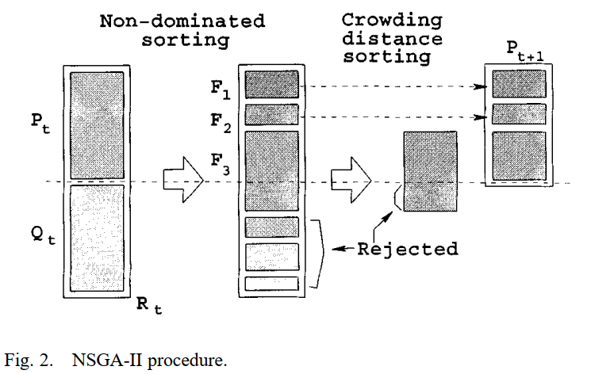
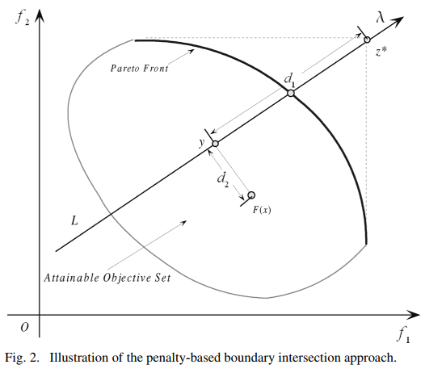
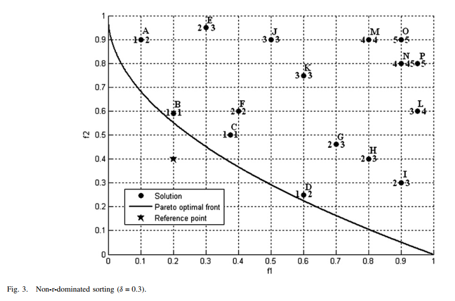

=============
Searchers
=============

Single-objective Optimization
==============================

MCTSSearcher
------------
    
Monte-Carlo Tree Search (MCTS) extends the celebrated Multi-armed Bandit algorithm to tree-structured search spaces. The MCTS algorithm iterates over four phases: selection, expansion, playout and backpropagation.
    
* Selection: In each node of the tree, the child node is selected after a Multi-armed Bandit strategy, e.g. the UCT (Upper Confidence bound applied to Trees) algorithm.

* Expansion: The algorithm adds one or more nodes to the tree. This node corresponds to the first encountered position that was not added in the tree.

* Playout: When reaching the limits of the visited tree, a roll-out strategy is used to select the options until reaching a terminal node and computing the associated
reward.

* Backpropagation: The reward value is propagated back, i.e. it is used to update the value associated to all nodes along the visited path up to the root node.

**Code example**

.. code-block:: python
   :linenos:

    from hypernets.searchers import MCTSSearcher

    searcher = MCTSSearcher(search_space_fn, use_meta_learner=False, max_node_space=10, candidates_size=10, optimize_direction='max')

**Required Parameters**

* *space_fn*: callable, A search space function which when called returns a ``HyperSpace`` instance.

**Optional Parameters**

- *policy*: hypernets.searchers.mcts_core.BasePolicy, (default=None), The policy for *Selection* and *Backpropagation* phases, ``UCT`` by default.
- *max_node_space*: int, (default=10), Maximum space for node expansion
- *use_meta_learner*: bool, (default=True), Meta-learner aims to evaluate the performance of unseen samples based on previously evaluated samples. It provides a practical solution to accurately estimate a search branch with many simulations without involving the actual training.
- *candidates_size*: int, (default=10), The number of samples for the meta-learner to evaluate candidate paths when roll out
- *optimize_direction*: 'min' or 'max', (default='min'), Whether the search process is approaching the maximum or minimum reward value.
- *space_sample_validation_fn*: callable or None, (default=None), Used to verify the validity of samples from the search space, and can be used to add specific constraint rules to the search space to reduce the size of the space.

EvolutionSearcher
-----------------

Evolutionary algorithm (EA) is a subset of evolutionary computation, a generic population-based metaheuristic optimization algorithm. An EA uses mechanisms inspired by biological evolution, such as reproduction, mutation, recombination, and selection. Candidate solutions to the optimization problem play the role of individuals in a population, and the fitness function determines the quality of the solutions (see also loss function). Evolution of the population then takes place after the repeated application of the above operators.

**Code example**

.. code-block:: python
   :linenos:

    from hypernets.searchers import EvolutionSearcher

    searcher = EvolutionSearcher(search_space_fn, population_size=20, sample_size=5, optimize_direction='min')

**Required Parameters**

- *space_fn*: callable, A search space function which when called returns a ``HyperSpace`` instance
- *population_size*: int, Size of population
- *sample_size*: int, The number of parent candidates selected in each cycle of evolution

**Optional Parameters**

- *regularized*: bool, (default=False), Whether to enable regularized
- *use_meta_learner*: bool, (default=True), Meta-learner aims to evaluate the performance of unseen samples based on previously evaluated samples. It provides a practical solution to accurately estimate a search branch with many simulations without involving the actual training.
- *candidates_size*: int, (default=10), The number of samples for the meta-learner to evaluate candidate paths when roll out
- *optimize_direction*: 'min' or 'max', (default='min'), Whether the search process is approaching the maximum or minimum reward value.
- *space_sample_validation_fn*: callable or None, (default=None), Used to verify the validity of samples from the search space, and can be used to add specific constraint rules to the search space to reduce the size of the space.

RandomSearcher
--------------

As its name suggests, Random Search uses random combinations of hyperparameters.

**Code example**

.. code-block:: python
   :linenos:

    from hypernets.searchers import RandomSearcher
    searcher = RandomSearcher(search_space_fn, optimize_direction='min')

**Required Parameters**

- *space_fn*: callable, A search space function which when called returns a `HyperSpace` instance

**Optional Parameters**

- *optimize_direction*: 'min' or 'max', (default='min'), Whether the search process is approaching the maximum or minimum reward value.
- *space_sample_validation_fn*: callable or None, (default=None), Used to verify the validity of samples from the search space, and can be used to add specific constraint rules to the search space to reduce the size of the space.

Multi-objective optimization
============================

NSGA-II: Non-dominated Sorting Genetic Algorithm
------------------------------------------------

NSGA-II is a dominate-based genetic algorithm used for multi-objective optimization. It rank individuals into levels
according to the dominance relationship then calculate crowded-distance within a level. The ranking levels and
crowded-distance are used to sort individuals in population and keep population size to be stable.

:class:`NSGASearcher` code example:

    >>> from sklearn.model_selection import train_test_split
    >>> from sklearn.preprocessing import LabelEncoder
    >>> from hypernets.core.random_state import set_random_state, get_random_state
    >>> from hypernets.examples.plain_model import PlainSearchSpace, PlainModel
    >>> from hypernets.model.objectives import create_objective
    >>> from hypernets.searchers.genetic import create_recombination
    >>> from hypernets.searchers.nsga_searcher import NSGAIISearcher
    >>> from hypernets.tabular.datasets import dsutils
    >>> from hypernets.tabular.sklearn_ex import MultiLabelEncoder
    >>> from hypernets.utils import logging as hyn_logging
    >>> hyn_logging.set_level(hyn_logging.WARN)
    >>> set_random_state(1234)

    >>> df = dsutils.load_bank().head(1000)
    >>> df['y'] = LabelEncoder().fit_transform(df['y'])
    >>> df.drop(['id'], axis=1, inplace=True)
    >>> X_train, X_test = train_test_split(df, test_size=0.2, random_state=1234)
    >>> y_train = X_train.pop('y')
    >>> y_test = X_test.pop('y')
    >>> random_state = get_random_state()
    >>> search_space = PlainSearchSpace(enable_dt=True, enable_lr=False, enable_nn=True)

    >>> rs = NSGAIISearcher(search_space,  objectives=[create_objective('auc'), create_objective('nf')],
    >>>                     recombination=create_recombination('single_point', random_state=random_state),
    >>>                     population_size=5,
    >>>                     random_state=random_state)
    >>> rs
    NSGAIISearcher(objectives=[PredictionObjective(name=auc, scorer=make_scorer(roc_auc_score, needs_threshold=True), direction=max), NumOfFeatures(name=nf, sample_size=2000, direction=min)], recombination=SinglePointCrossOver(random_state=RandomState(MT19937))), mutation=SinglePointMutation(random_state=RandomState(MT19937), proba=0.7)), survival=<hypernets.searchers.nsga_searcher.RankAndCrowdSortSurvival object at 0x000002851D8A4910>), random_state=RandomState(MT19937)

    >>> hk = PlainModel(rs, task='binary', transformer=MultiLabelEncoder)
    >>> hk.search(X_train, y_train, X_test, y_test, max_trials=10)
    >>> rs.get_population()[:3]
    [NSGAIndividual(scores=[0.768788682581786, 0.125], rank=0, n=0, distance=inf),
     NSGAIndividual(scores=[0.7992926613616268, 0.1875], rank=0, n=0, distance=inf),
     NSGAIndividual(scores=[0.617816091954023, 0.1875], rank=1, n=0, distance=inf)]

References:

[1] Deb, Kalyanmoy, et al. "A fast and elitist multiobjective genetic algorithm: NSGA-II." IEEE transactions on evolutionary computation 6.2 (2002): 182-197.

MOEA/D: Multiobjective Evolutionary Algorithm Based on Decomposition
--------------------------------------------------------------------

MOEA/D is a decomposition-based genetic algorithm framework used for multi-objective optimization.
It decomposes multi-objective optimization problem into several sub optimization problem in different directions.
One an excellent solution for a sub problem is obtained it will share the genes with it's neighbors since the neighboring sub problems are similar,
thus, this mechanism can accelerate convergence process. One more thing,  it's a framework that can support several decomposition approaches for different situations, now we supported:

- Weighted Sum Approach: straight and effective approach
- Tchebycheff Approach : working in case of the solution space is concavity
- Penalty-based boundary intersection approach(PBI): suitable for high-dimensional solution spaces

:class:`MOEADSearcher` code example:

    >>> from sklearn.model_selection import train_test_split
    >>> from sklearn.preprocessing import LabelEncoder
    >>> from hypernets.core.random_state import set_random_state, get_random_state
    >>> from hypernets.examples.plain_model import PlainSearchSpace, PlainModel
    >>> from hypernets.model.objectives import create_objective
    >>> from hypernets.searchers.genetic import create_recombination
    >>> from hypernets.searchers.moead_searcher import MOEADSearcher
    >>> from hypernets.tabular.datasets import dsutils
    >>> from hypernets.tabular.sklearn_ex import MultiLabelEncoder
    >>> from hypernets.utils import logging as hyn_logging
    >>> hyn_logging.set_level(hyn_logging.WARN)
    >>> set_random_state(1234)

    >>> df = dsutils.load_bank().head(1000)
    >>> df['y'] = LabelEncoder().fit_transform(df['y'])
    >>> df.drop(['id'], axis=1, inplace=True)
    >>> X_train, X_test = train_test_split(df, test_size=0.2, random_state=1234)
    >>> y_train = X_train.pop('y')
    >>> y_test = X_test.pop('y')

    >>> random_state = get_random_state()
    >>> search_space = PlainSearchSpace(enable_dt=True, enable_lr=False, enable_nn=True)
    >>> rs = MOEADSearcher(search_space,  objectives=[create_objective('logloss'), create_objective('nf')],
    >>>                    recombination=create_recombination('single_point', random_state=random_state),
    >>>                    random_state=random_state)
    >>> rs
    MOEADSearcher(objectives=[PredictionObjective(name=logloss, scorer=make_scorer(log_loss, needs_proba=True), direction=min), NumOfFeatures(name=nf, sample_size=2000, direction=min)], n_neighbors=2, recombination=SinglePointCrossOver(random_state=RandomState(MT19937)), mutation=SinglePointMutation(random_state=RandomState(MT19937), proba=0.3), population_size=6)

    >>> hk = PlainModel(rs, task='binary', transformer=MultiLabelEncoder)
    >>> hk.search(X_train, y_train, X_test, y_test, max_trials=10)
    >>> rs.get_population()[:3]
    [Individual(dna=DAG_HyperSpace_1, scores=[10.632877749789559, 0.1875], random_state=RandomState(MT19937)),
     Individual(dna=DAG_HyperSpace_1, scores=[0.4372370852623173, 1.0], random_state=RandomState(MT19937)),
     Individual(dna=DAG_HyperSpace_1, scores=[6.494675998141714, 0.6875], random_state=RandomState(MT19937))]

References:

[1] Zhang, Qingfu, and Hui Li. "MOEA/D: A multiobjective evolutionary algorithm based on decomposition." IEEE Transactions on evolutionary computation 11.6 (2007): 712-731.

R-Dominance: dominance relation for multicriteria decision making
-----------------------------------------------------------------

R-NSGA-II is a variant of NSGA-II, used for multi-objective optimization but considering the decision preferences of decision-makers(DMs).
It comprehensively considers the pareto dominance relationship and the reference points provided by DMs to search for non-dominated solutions near reference points to assist users in making decisions.

:class:`RNSGAIISearcher` code example:

    >>> import numpy as np
    >>> from sklearn.model_selection import train_test_split
    >>> from sklearn.preprocessing import LabelEncoder
    >>> from hypernets.core.random_state import set_random_state, get_random_state
    >>> from hypernets.examples.plain_model import PlainSearchSpace, PlainModel
    >>> from hypernets.model.objectives import create_objective
    >>> from hypernets.searchers.genetic import create_recombination
    >>> from hypernets.searchers.nsga_searcher import RNSGAIISearcher
    >>> from hypernets.tabular.datasets import dsutils
    >>> from hypernets.tabular.sklearn_ex import MultiLabelEncoder
    >>> from hypernets.utils import logging as hyn_logging
    >>> hyn_logging.set_level(hyn_logging.WARN)
    >>> set_random_state(1234)

    >>> df = dsutils.load_bank().head(1000)
    >>> df['y'] = LabelEncoder().fit_transform(df['y'])
    >>> df.drop(['id'], axis=1, inplace=True)
    >>> X_train, X_test = train_test_split(df, test_size=0.2, random_state=1234)
    >>> y_train = X_train.pop('y')
    >>> y_test = X_test.pop('y')

    >>> random_state = get_random_state()
    >>> search_space = PlainSearchSpace(enable_dt=True, enable_lr=False, enable_nn=True)
    >>> rs = RNSGAIISearcher(search_space,  objectives=[create_objective('logloss'), create_objective('nf')],
    >>>                      ref_point=np.array([0.2, 0.3]),
    >>>                      recombination=create_recombination('single_point', random_state=random_state),
    >>>                      random_state=random_state)
    >>> rs
    RNSGAIISearcher(objectives=[PredictionObjective(name=logloss, scorer=make_scorer(log_loss, needs_proba=True), direction=min), NumOfFeatures(name=nf, sample_size=2000, direction=min)], recombination=SinglePointCrossOver(random_state=RandomState(MT19937))), mutation=SinglePointMutation(random_state=RandomState(MT19937), proba=0.7)), survival=RDominanceSurvival(ref_point=[0.2 0.3], weights=[0.5, 0.5], threshold=0.3, random_state=RandomState(MT19937))), random_state=RandomState(MT19937)

    >>> hk = PlainModel(rs, task='binary', transformer=MultiLabelEncoder)
    >>> hk.search(X_train, y_train, X_test, y_test, max_trials=10)
    >>> rs.get_population()[:3]
    [NSGAIndividual(scores=[10.632877749789559, 0.1875], rank=-1, n=-1, distance=-1.0),
     NSGAIndividual(scores=[0.4372370852623173, 1.0], rank=-1, n=-1, distance=-1.0),
     NSGAIndividual(scores=[6.494675998141714, 0.6875], rank=-1, n=-1, distance=-1.0)]

References:

[1] Said, Lamjed Ben, Slim Bechikh, and Khaled Ghédira. "The r-dominance: a new dominance relation for interactive evolutionary multicriteria decision making." IEEE transactions on Evolutionary Computation 14.5 (2010): 801-818.
